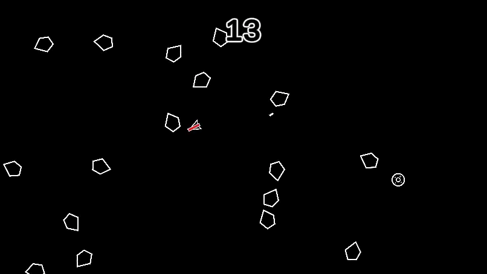
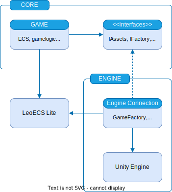

# Asteroidecs
A simple example of [asteroids game](https://en.wikipedia.org/wiki/Asteroids_(video_game)) using [Entity Component System (ECS)](https://en.wikipedia.org/wiki/Entity_component_system) implementation by [LeoEcs Lite](https://github.com/Leopotam/ecslite) for gameplay logic and Unity Engine for rendering, physics, resource management and other.

# Gameplay

  

## How to play
This is an endless game, the objective is to destroy asteroids and aliens and earn points for it. Any collision with an asteroid or an alien ends in defeat. After that, the game can be started from the beginning with zero points.

### Difficulty
The game has only one difficulty level. However, it can be configured in the [json file settings](/src/Asteroidecs/Assets/Prefabs/Settings/Config.json): change player's spaceship stats, increase or decrease spawn time for asteroids and aliens, and their stats - movement speed, health and destruction bonus.

### Control
- **WASD** - spaceship movement direction.
- **Mouse Position** - spaceship firing direction.
- **Left Click** - a simple laser that destroyed on collision with something, because it has only 1 health point. 
- **Right Click** - a red laser that has 2 health point and can destroy 2 asteroids or 1 alien ship before self destroying by collision.

All control logic is encapsulated in a class [UnityInput](/src/Asteroidecs/Assets/CodeBase/Engine/Services/UnityInput.cs).

# Architecture
An important issue is how the core logic communicates with the engine's external logic. For dependency inversion uses interfaces within the core assembly referenced by the engine assembly. Thus, the core assembly does not know anything about the game engine used. ECS dictates a flat architecture, there is nothing special in core assembly. 

In engine assembly, game engine (Unity) interacts with ECS core via [MonoLinks](/src/Asteroidecs/Assets/CodeBase/Engine/MonoLinks/Base/MonoLink.cs).

## Entry Point
The game starts without an initial scene, instead using a pure C# class with the [RuntimeInitializeOnLoadMethod](https://docs.unity3d.com/ScriptReference/RuntimeInitializeOnLoadMethodAttribute.html) attribute. This is default main method imitation from pure C#. Resource management uses Addressables to load resources from the prefab folder. 

The game is constructed at the [entry point](/src/Asteroidecs/Assets/CodeBase/EntryPoint.cs).

## Diagram

  

# Screenshots

  
  

